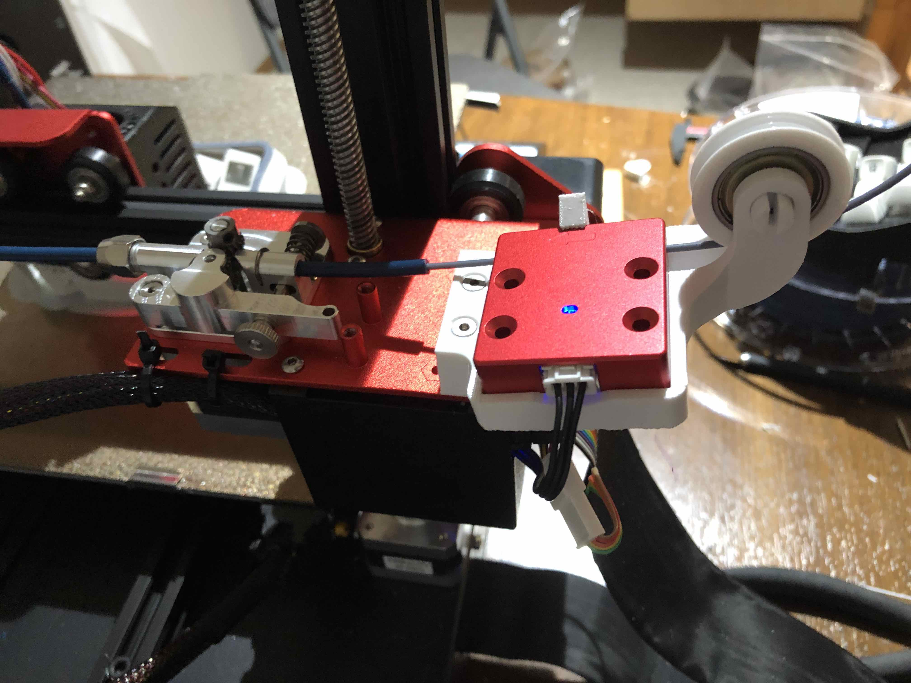

# CR-10s pro v2 runout sensor holder for micro swiss bowden extruder

The micro swiss bowden dual gear extruder doesn't line up with the runout sensor on the CR-10s Pro V2, and likely any creality printed that has the runout sensor on stilts. This design positions the runout sensor in line with the filament path when paired with the micro swiss extruder.

The filament path wheel uses a 608 bearing.

The pin and bearing wheel thing are based on this design https://www.thingiverse.com/thing:3148615

If the bearing wheel thing is too small, the fusion 360 drawings from the above is available to be modified, or scaling up a bit might be ok, there's a fair amount of extra space between the posts.
